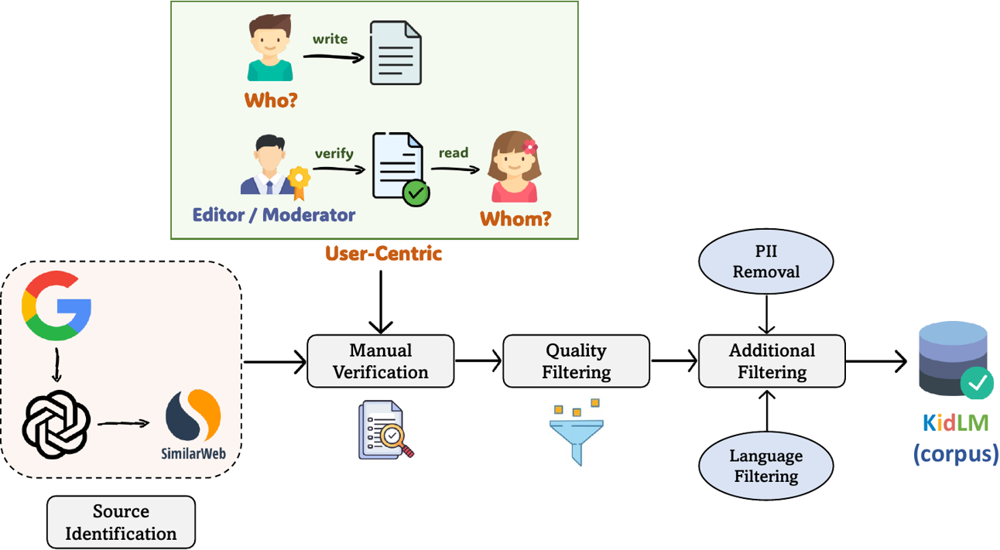

# KidLM

This is the official repository for our paper, titled ["KidLM: Advancing Language Models for Children – Early Insights and Future Directions,"](https://aclanthology.org/2024.emnlp-main.277/) published at the 2024 Conference on Empirical Methods in Natural Language Processing (EMNLP 2024). 


<p align="center">
  <a href="https://huggingface.co/collections/tafseer-nayeem/kidlm-672e5afcdc68cedc1c5df812">
    
  </a>
</p>

<p align="center">
  [
  <a href="https://huggingface.co/collections/tafseer-nayeem/kidlm-672e5afcdc68cedc1c5df812">KidLM Collection</a> ||
  <a href="https://huggingface.co/datasets/tafseer-nayeem/KidLM-corpus">KidLM Corpus</a> ||
  <a href="https://huggingface.co/tafseer-nayeem?search_models=KidLM">KidLM Models</a> ||
  <a href="https://aclanthology.org/2024.emnlp-main.277/">EMNLP 2024 Paper</a>
  ]
</p>


## Abstract

> Recent studies highlight the potential of large language models in creating educational tools for children, yet significant challenges remain in maintaining key child-specific properties such as linguistic nuances, cognitive needs, and safety standards. In this paper, we explore foundational steps toward the development of child-specific language models, emphasizing the necessity of high-quality pre-training data. We introduce a novel user-centric data collection pipeline that involves gathering and validating a corpus specifically written for and sometimes by children. Additionally, we propose a new training objective, Stratified Masking, which dynamically adjusts masking probabilities based on our domain-specific child language data, enabling models to prioritize vocabulary and concepts more suitable for children. Experimental evaluations demonstrate that our model excels in understanding lower grade-level text, maintains safety by avoiding stereotypes, and captures children’s unique preferences. Furthermore, we provide actionable insights for future research and development in child-specific language modeling.


## KidLM (corpus)

The KidLM corpus consists of high-quality, child-appropriate content specifically written for children and occasionally by them. This content has been meticulously reviewed and validated by website editors or moderators to ensure suitability and to eliminate any inappropriate content or sensationalism. Our user-centric data collection pipeline with quality filtering is comprehensive, diverse, and carefully tailored for developing language models aimed at young audiences. 

### User-Centric Data Collection Pipeline

<p align="center">
  <a href="https://huggingface.co/datasets/tafseer-nayeem/KidLM-corpus">
    
  </a>
</p>


Our corpus is available here: 🤗 [KidLM (corpus)](https://huggingface.co/datasets/tafseer-nayeem/KidLM-corpus)


## KidLM Models

- [KidLM](https://huggingface.co/tafseer-nayeem/KidLM): We continue pre-train the [RoBERTa (base)](https://huggingface.co/FacebookAI/roberta-base) model on our [KidLM corpus](https://huggingface.co/datasets/tafseer-nayeem/KidLM-corpus) using a masked language modeling (MLM) objective. This approach involves randomly masking 15% of the words in each input sequence, allowing the model to predict the masked words based on their surrounding context. For more details, please refer to our [EMNLP 2024 paper](https://aclanthology.org/2024.emnlp-main.277/).

- [KidLM (plus)](https://huggingface.co/tafseer-nayeem/KidLM-plus): We continue to pre-train the [RoBERTa (base)](https://huggingface.co/FacebookAI/roberta-base) model on our [KidLM corpus](https://huggingface.co/datasets/tafseer-nayeem/KidLM-corpus) using a masked language modeling (MLM) objective. The KidLM (plus) model introduces a masking strategy called **Stratified Masking**, which varies the probability of masking based on word classes. This approach enhances the model's focus on tokens that are more informative and specifically tailored to children's language needs, aiming to steer language model predictions towards child-specific vocabulary derived from our high-quality [KidLM corpus](https://huggingface.co/datasets/tafseer-nayeem/KidLM-corpus).

For more details, please refer to our [EMNLP 2024 paper](https://aclanthology.org/2024.emnlp-main.277/).


## Licensing Information

Contents of this repository are restricted to only non-commercial research purposes under the [Creative Commons Attribution-NonCommercial-ShareAlike 4.0 International License (CC BY-NC-SA 4.0)](https://creativecommons.org/licenses/by-nc-sa/4.0/). Copyright of the dataset contents belongs to the original copyright holders.

---

## Citation Information

If you use any of the resources or it's relevant to your work, please cite our [EMNLP 2024 paper](https://aclanthology.org/2024.emnlp-main.277/). 

```
@inproceedings{nayeem-rafiei-2024-kidlm,
    title = "{K}id{LM}: Advancing Language Models for Children {--} Early Insights and Future Directions",
    author = "Nayeem, Mir Tafseer  and
      Rafiei, Davood",
    editor = "Al-Onaizan, Yaser  and
      Bansal, Mohit  and
      Chen, Yun-Nung",
    booktitle = "Proceedings of the 2024 Conference on Empirical Methods in Natural Language Processing",
    month = nov,
    year = "2024",
    address = "Miami, Florida, USA",
    publisher = "Association for Computational Linguistics",
    url = "https://aclanthology.org/2024.emnlp-main.277",
    pages = "4813--4836",
    abstract = "Recent studies highlight the potential of large language models in creating educational tools for children, yet significant challenges remain in maintaining key child-specific properties such as linguistic nuances, cognitive needs, and safety standards. In this paper, we explore foundational steps toward the development of child-specific language models, emphasizing the necessity of high-quality pre-training data. We introduce a novel user-centric data collection pipeline that involves gathering and validating a corpus specifically written for and sometimes by children. Additionally, we propose a new training objective, Stratified Masking, which dynamically adjusts masking probabilities based on our domain-specific child language data, enabling models to prioritize vocabulary and concepts more suitable for children. Experimental evaluations demonstrate that our model excels in understanding lower grade-level text, maintains safety by avoiding stereotypes, and captures children{'}s unique preferences. Furthermore, we provide actionable insights for future research and development in child-specific language modeling.",
}
```